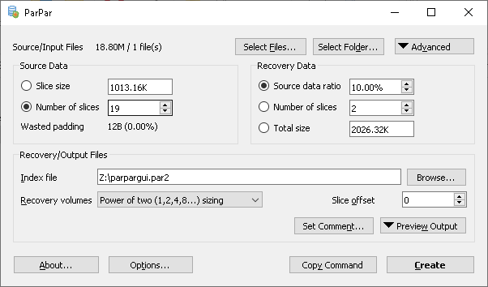

ParPar GUI
======

ParPar GUI is a graphical front-end to the [command-line ParPar application](https://github.com/animetosho/ParPar), which is a high performance, multi-threaded [PAR2](https://en.wikipedia.org/wiki/Parchive) *creation-only* tool (verify/repair unsupported). The GUI exposes most of ParPar’s features, saving users from having to learn the command-line flags for most functionality.

Currently, this application is targeting the upcoming v0.4.0 release of ParPar and is only available for preview for now.



# Download

See the [Releases page](https://github.com/animetosho/ParParGUI/releases).

Compiling from Source
=======================

ParPar GUI is built using the C++/Qt framework. It should be compatible with both Qt5 and Qt6 versions
As such, you’ll need C++ build tools and the QtWidgets library (or the whole Qt SDK), then compile via CMake.

The following are sample commands for Debian Linux:

```bash
apt-get install build-essential cmake qtbase5-dev
cmake .  # in the directory of the source code
make
# result should be a binary './parpargui'
```

Alternatively, you can [install Qt Creator](https://www.qt.io/download-qt-installer), run it and load the *CMakeLists.txt* file as a project, and compile that.

Once built, you’ll need to ensure ParPar GUI can find ParPar itself. By default, it’ll automatically search the current directory for ParPar binaries, or the *bin/parpar.js* file along with the Node.js interpreter. Alternatively, the correct paths can be configured via the Options dialog.
See [building info](https://github.com/animetosho/ParPar#install-from-source) on ParPar’s side for help on obtaining ParPar (note that the current release version (v0.3.2) is incompatible with this GUI).

License
=======

This code is Public Domain or [CC0](https://creativecommons.org/publicdomain/zero/1.0/legalcode) (or equivalent) if PD isn’t recognised.
